# 🎓 Mutafs EduPortal

## Multi-School Education Management & SaaS Platform

**Mutafs EduPortal** is a comprehensive Django-based multi-school education management and SaaS platform designed to support schools, administrators, teachers, students, parents, and other education stakeholders through an integrated digital environment.

The platform brings academic administration, student management, staff operations, attendance, examinations, results, finance, communication, analytics, institutional management, and platform-level administration together within a unified system.

Mutafs EduPortal is structured beyond a conventional school website or single-school management application. Its architecture includes school-level management, subscription controls, tenant-aware functionality, and centralized platform administration suitable for a multi-school education ecosystem.

---

## 📸 Platform Preview

### Login Interface

The platform provides a modern centralized authentication interface for authorized users while also providing access to selected public-facing services.

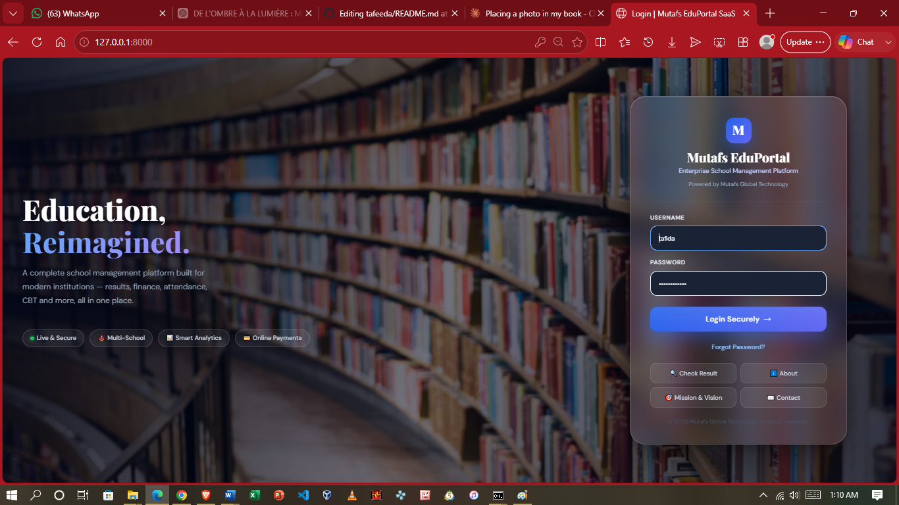

---

## 🏢 SaaS Platform Administration

Mutafs EduPortal includes a centralized **Super Admin Headquarters** for monitoring schools, subscriptions, users, financial activity, CBT usage, published results, and other platform-wide information.

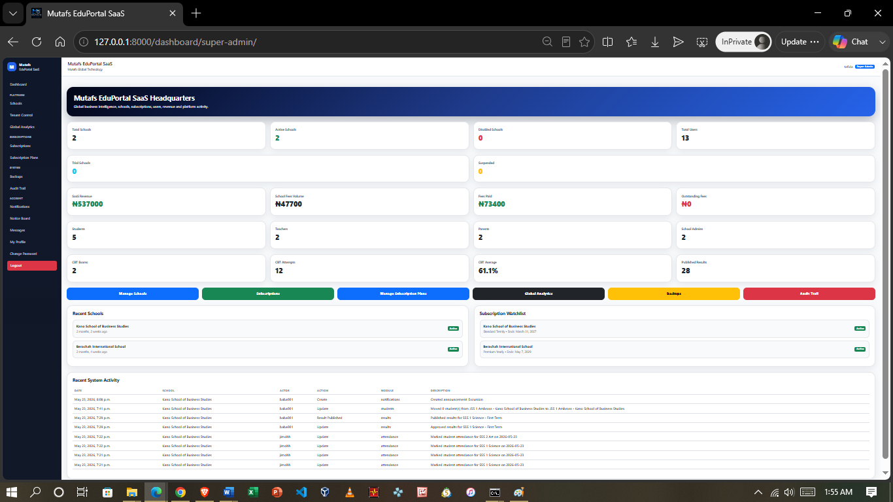

### Platform-Wide Dashboard View

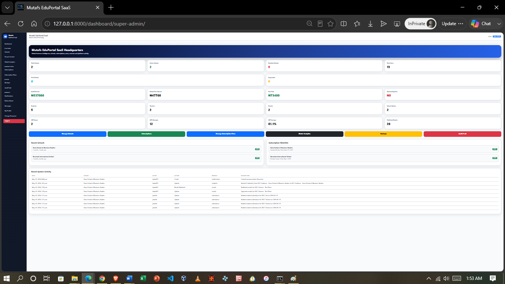

### Additional Super Admin Overview

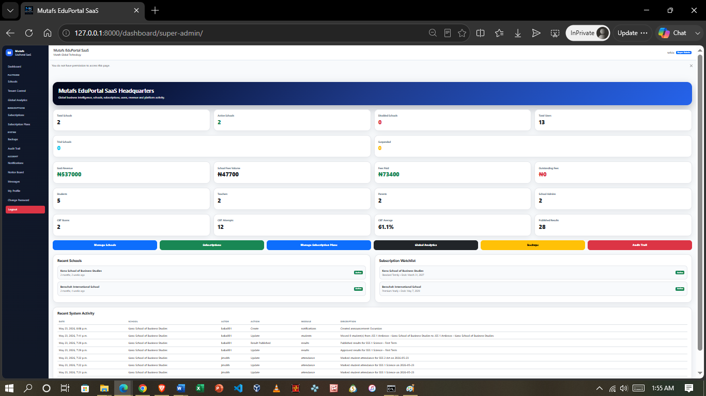

---

## 📌 Project Overview

Mutafs EduPortal provides a centralized digital platform for managing educational institutions and their day-to-day academic and administrative operations.

The system includes dedicated modules for:

- User and account management
- Multi-school management
- Academic administration
- Student management
- Parent/guardian management
- Staff and teacher management
- Attendance management
- Results and assessment management
- Computer-Based Testing (CBT)
- Lesson resources
- Timetable management
- Financial operations
- Online transactions
- Notifications
- Messaging
- Analytics
- Audit logging
- Subscription management
- Public portal services
- User profiles
- Backup functionality
- Data import/export tools
- Intelligence-assisted functionality

The project is designed with extensibility in mind so that additional institutional and education-management capabilities can be incorporated as the platform evolves.

---

## 🏫 Multi-School SaaS Architecture

Mutafs EduPortal includes school-aware application components and middleware intended to support institution-level controls.

The architecture includes functionality for:

- Multiple schools
- School-specific operations
- Tenant-aware application behavior
- School status management
- Subscription management
- Subscription plan controls
- Centralized platform administration
- School-level administrators
- Platform-wide analytics
- SaaS revenue monitoring

This architecture provides a foundation for operating the system as a multi-school education SaaS platform rather than restricting the application to a single institution.

---

## 💳 Subscription Management

The platform provides subscription-plan management capabilities for controlling school access to platform services.

Subscription plans can define limits and access to selected platform functionality.

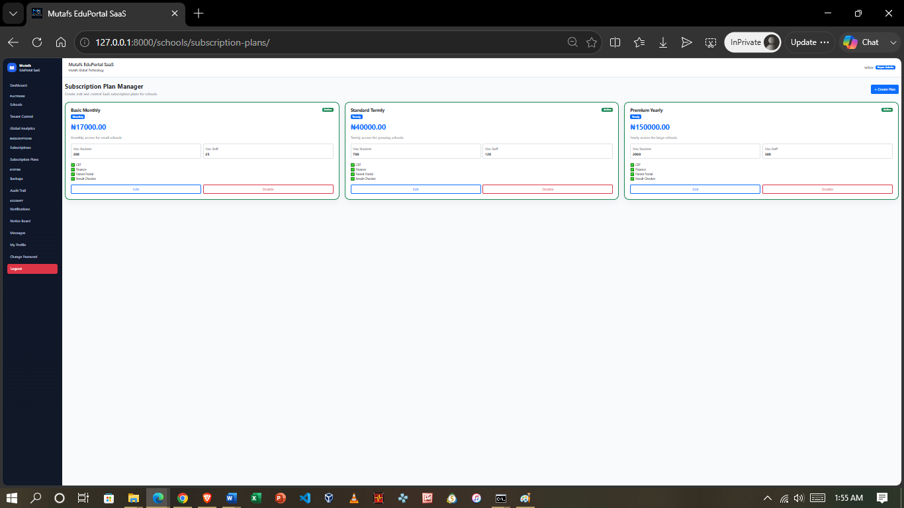

---

## 🛡️ Audit & Accountability

Administrative and system activities can be recorded through the platform's audit functionality, supporting accountability and operational monitoring.

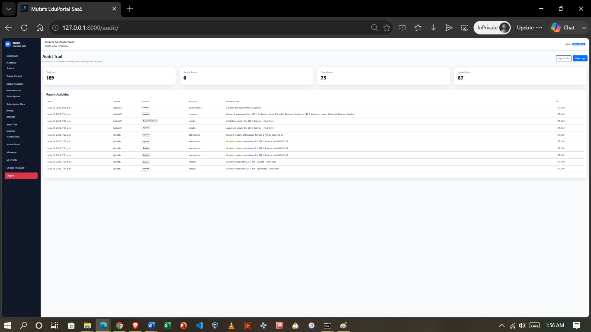

---

## 🏫 School Management

Schools can be managed individually within the SaaS environment, including institutional information, administrators, subscription status, portal configuration, and school activity.

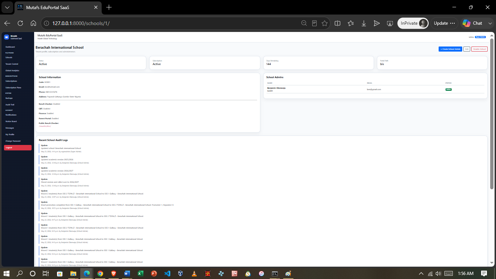

---

## 🧑‍💼 School Administration

Each institution can operate through a dedicated school administration environment.

The School Admin dashboard provides access to school-level information such as students, teachers, parents, classes, subjects, attendance, financial information, CBT activity, academic results, announcements, and other institutional operations.

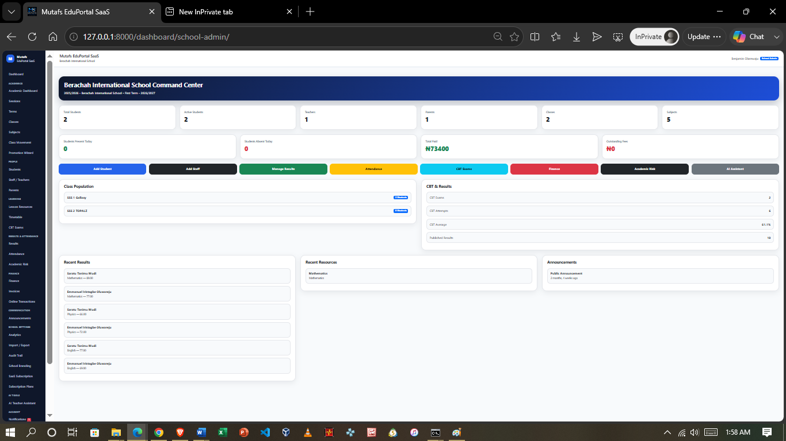

---

## 🎓 Student Management

The student management module supports registration and maintenance of student information including:

- Personal information
- Gender and date of birth
- Passport photograph
- Current class
- Admission date
- Student status
- Guardian information
- Contact details
- Address information
- Student login credentials

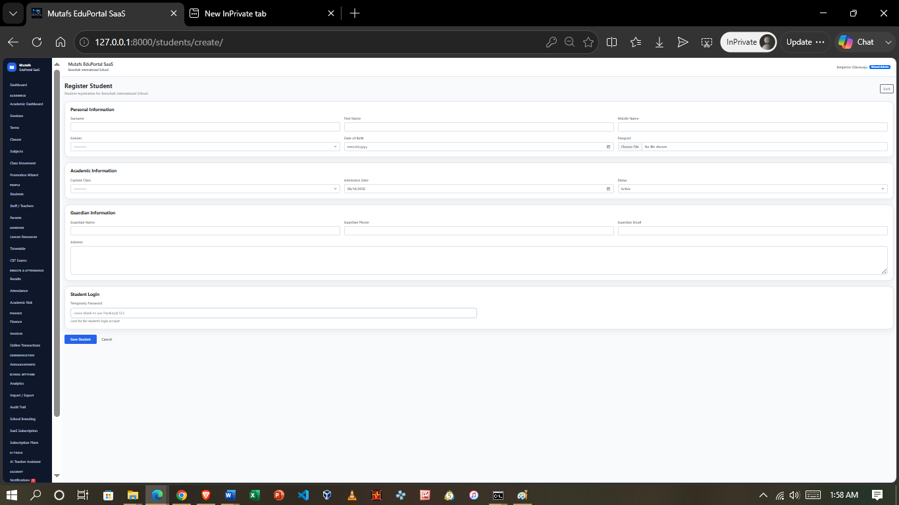

---

## 👨‍🏫 Teacher Workspace

Teachers have a dedicated workspace providing access to their assigned academic responsibilities.

Available functions include class access, attendance management, result entry, lesson resources, academic-risk information, timetable information, notifications, and intelligence-assisted functionality.

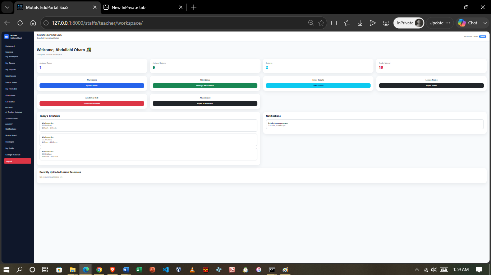

---

## 📝 Attendance Management

The attendance module supports daily student attendance management and reporting.

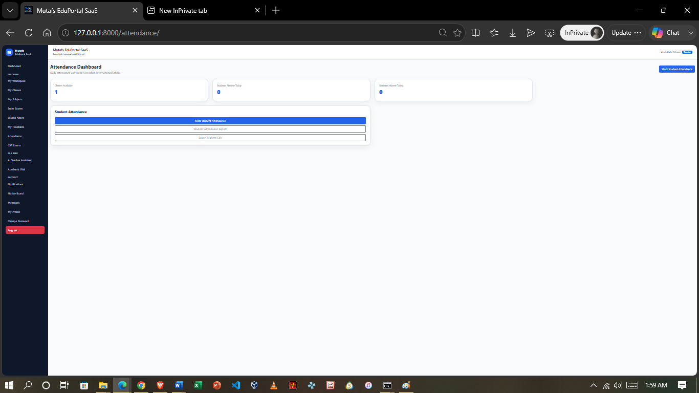

---

## 💻 Computer-Based Testing (CBT)

Mutafs EduPortal includes an integrated **CBT Examination Engine**.

The module provides functionality for:

- Question-bank management
- Exam creation
- Active examination management
- Student examination attempts
- Submitted attempts
- Scores and reports

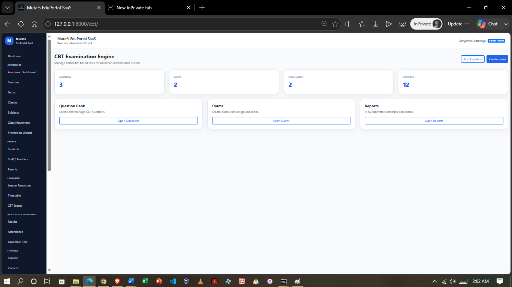

---

## 📊 Results & Assessment Management

The result-management module supports academic score entry, publication controls, and grading configuration.

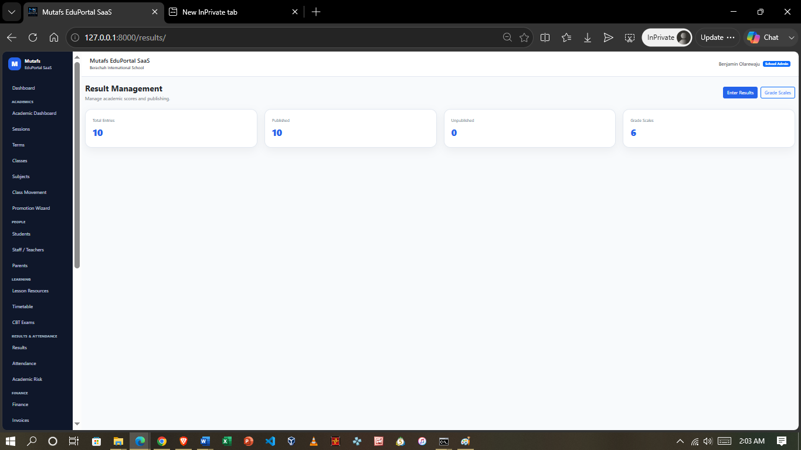

---

## 💳 Finance Management

The finance module provides school-level billing and payment-management functionality.

Available functionality includes:

- Fee categories
- Fee structures
- Invoice management
- Payment monitoring
- Online transactions
- Outstanding-fee monitoring

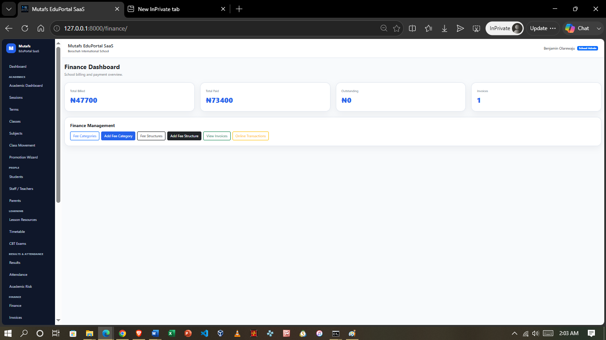

---

## 👨‍👩‍👧 Parent / Guardian Portal

Parents and guardians have access to a dedicated portal for monitoring their linked children.

The portal can provide information relating to:

- Linked children
- Attendance
- Academic results
- Outstanding fees
- Timetable information
- Notifications
- Academic insights
- Payment history
- Messages

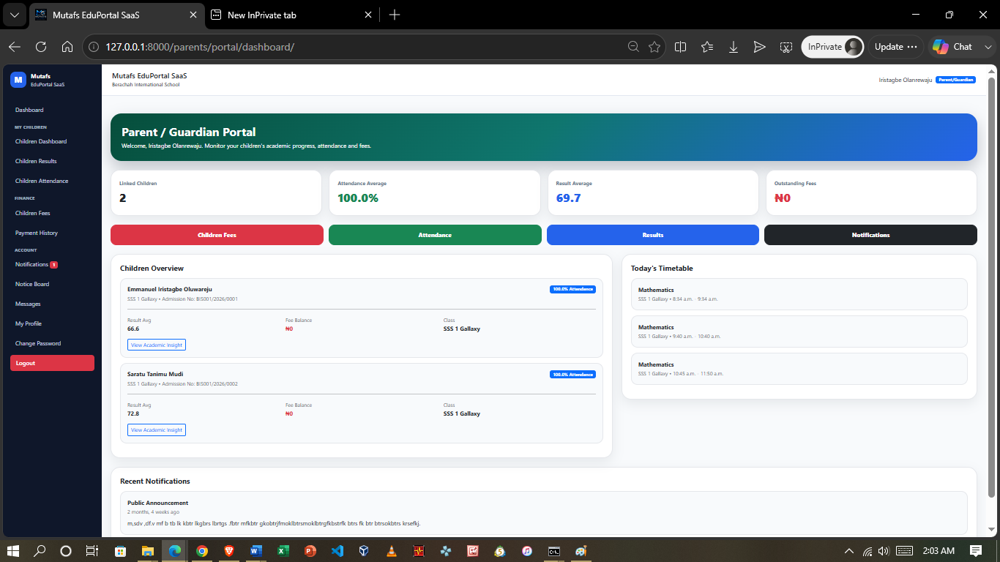

---

## 📈 Global SaaS Analytics

Platform administrators can monitor high-level information across the Mutafs EduPortal ecosystem through global analytics.

Available information includes school activity, subscription information, SaaS revenue, school fee information, users, CBT activity, results, audit information, and school-level comparisons.

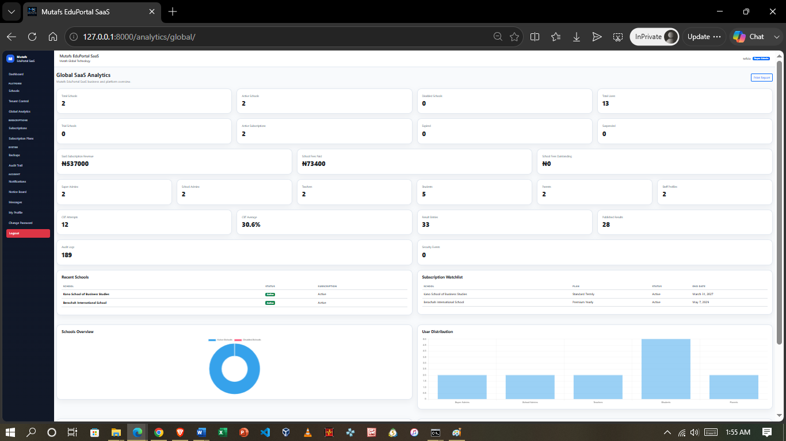

---

## 🌐 Centralized School Management

The platform provides a centralized interface for managing schools operating within the SaaS environment.

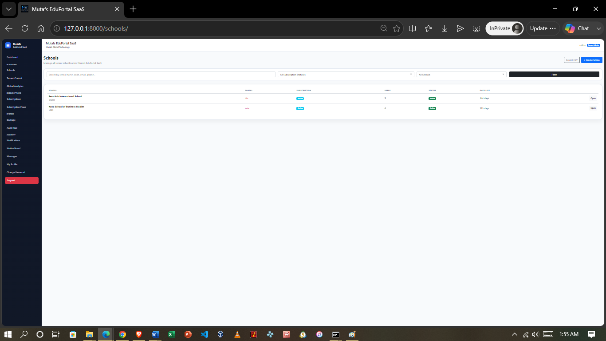

---

## 👥 Core Platform Areas

### 🎓 Students
Supports student-related academic and administrative operations within the platform.

### 👨‍👩‍👧 Parents
Provides dedicated parent/guardian functionality and access to linked student information.

### 👨‍🏫 Staff & Teachers
Supports staff records, teaching responsibilities, and institution-level staff management.

### 🏫 Schools
Provides school-level functionality forming part of the platform's multi-school architecture.

### 📚 Academics
Supports core academic administration and institutional academic processes.

### 📝 Attendance
Provides functionality for recording and managing attendance information.

### 📊 Results
Supports academic result, grading, publication, and assessment management.

### 💻 Computer-Based Testing
Provides computer-based examination and assessment functionality.

### 📖 Lessons
Supports lesson resources and related academic operations.

### 📅 Timetable
Provides timetable functionality for academic scheduling.

### 💳 Finance
Supports billing, fee structures, invoices, payments, and other financial operations.

### 🔔 Notifications
Provides system notification functionality.

### 💬 Messaging
Supports internal communication capabilities.

### 📈 Analytics
Provides institutional and platform-level analytical functionality.

### 🛡️ Audit
Supports accountability and activity tracking.

### 🌐 Public Portal
Provides selected public-facing functionality separate from authenticated institutional operations.

### 🧠 Intelligence
Provides a foundation for intelligence-assisted functionality within the platform.

### 💾 Backups & Data Tools
Includes functionality supporting backup operations and data-management activities.

---

## 🧠 AI Integration

The application architecture includes configuration for OpenAI-powered functionality.

API credentials are configured through environment variables and are not intended to be stored directly in source code.

This provides a foundation for intelligence-assisted education and administrative functionality as the platform evolves.

---

## 💳 Payment Integration

Mutafs EduPortal includes configuration for Paystack integration to support payment-related functionality within the platform.

Sensitive Paystack credentials are supplied through environment variables rather than hard-coded into the repository.

---

## 🔐 Security

The platform includes several security-oriented controls, including:

- Django authentication
- Password validation
- Password hashing
- CSRF protection
- Secure session configuration
- Clickjacking protection
- Content-type protection
- Environment-based secret management
- Production HTTPS enforcement
- Secure production cookies
- HSTS support
- Audit functionality
- School status controls
- Subscription controls

Production configuration is separated from development configuration to allow stronger security policies to be applied during deployment.

---

## 🏗️ Technology Stack

### Backend

- Python
- Django

### Frontend

- HTML5
- CSS3
- JavaScript
- Django Templates

### Database

Database configuration is environment-driven.

SQLite can be used as the local development fallback while production environments can provide an external database through `DATABASE_URL`.

### Additional Components

- WhiteNoise
- django-filter
- django-widget-tweaks
- CKEditor
- dj-database-url
- python-decouple
- django-environ
- Paystack integration
- OpenAI integration

---

## ⚙️ Environment Configuration

Sensitive configuration should be supplied through environment variables.

Typical environment variables include:

```env
SECRET_KEY=
DEBUG=
ALLOWED_HOSTS=
DATABASE_URL=
SITE_URL=

OPENAI_API_KEY=
OPENAI_MODEL=

PAYSTACK_SECRET_KEY=
PAYSTACK_PUBLIC_KEY=
PAYSTACK_CALLBACK_URL=

EMAIL_BACKEND=
DEFAULT_FROM_EMAIL=


🗂️ Project Structure
mutafs_eduportal/
│
├── apps/
│   ├── accounts/
│   ├── academics/
│   ├── analytics/
│   ├── attendance/
│   ├── audit/
│   ├── backups/
│   ├── cbt/
│   ├── core/
│   ├── data_tools/
│   ├── finance/
│   ├── intelligence/
│   ├── lessons/
│   ├── messaging/
│   ├── notifications/
│   ├── parents/
│   ├── profiles/
│   ├── public_portal/
│   ├── results/
│   ├── schools/
│   ├── staffs/
│   ├── students/
│   └── timetable/
│
├── config/
│   └── settings/
│       ├── base.py
│       ├── development.py
│       ├── production.py
│       └── testing.py
│
├── Documentation/
│   └── screenshots/
│
├── static/
├── templates/
├── manage.py
├── requirements.txt
├── Procfile
└── runtime.txt
🚀 Development Setup
1. Clone the Repository
git clone <repository-url>
cd mutafs_eduportal
2. Create a Virtual Environment

On Windows:

python -m venv venv
venv\Scripts\activate
3. Install Dependencies
pip install -r requirements.txt
4. Configure Environment Variables

Create a local .env file and provide the required development configuration.

Do not commit the .env file to GitHub.

5. Run Database Migrations
python manage.py migrate
6. Create an Administrator Account

If required:

python manage.py createsuperuser
7. Start the Development Server
python manage.py runserver

The local development server will normally be available at:

http://127.0.0.1:8000/

🌍 Deployment Architecture

The project separates development, testing, and production configuration.

Production configuration includes additional security controls such as:

DEBUG = False
HTTPS redirection
Secure session cookies
Secure CSRF cookies
HTTP Strict Transport Security
Trusted-origin configuration

Production secrets and deployment-specific values should be supplied through environment variables.

📊 Project Status

Status: Active Development

The platform already contains a substantial multi-module and multi-school education management architecture and continues to be developed and refined.

Future development may include additional automation, intelligence-assisted functionality, reporting, integrations, and institutional-management capabilities.

⚠️ Security Notice

This repository should not contain production credentials or confidential institutional data.

Before any production deployment:

Configure a strong production SECRET_KEY
Disable debug mode
Configure approved hosts
Configure trusted CSRF origins
Use secure database credentials
Protect third-party API credentials
Use HTTPS
Review uploaded media and backup policies
Perform deployment security checks
📄 License

Licensing and usage terms for Mutafs EduPortal will be defined by the project owner.

🎓 Mutafs EduPortal

Building a centralized digital environment for modern education management.
